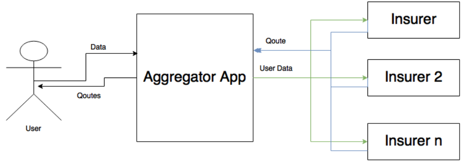

# Business case

__Online car insurance broker__

Online insurance broker where user can compare and choose the best car insurance.
User inputs data and gets offers from multiple insurance companies.

## Requirements

Implement java based application where:
* Main page where user enters input data
* Result page where recieved insurance offers are displayed
 * Chepest price is shown on top
* Integrate 2 insurer rest services 
 * Insurer 1 - rest swagger definition: http://localhost:8181/rest/api-doc
 * Insurer 2 - rest swagger definition: http://localhost:8282/rest/api-doc
* Implement simple Admin UI where admin user can configure rest service endpoints 

There are no strict requirements on UI, you may include minimum amount of data/fields to be requested from end-users. 

To run local services use Docker compose docker-compose up --build -d
You can browse api spec on Swagger UI http://localhost:8082/

## Deliverables

1.  __Arhitecture and design__ Please describe / draw main components of web application, how would you build the system. Please describe a reason of choosing an architecture, technologies, frameworks, etc. You may draw by hand and take a photo, e.g. its not required to use tools for UML, dataflow, MS Office, etc.
2.  __Source code__  commited to this repository.
3.  __Build & Run Script__ Single script to build and run the solution.
